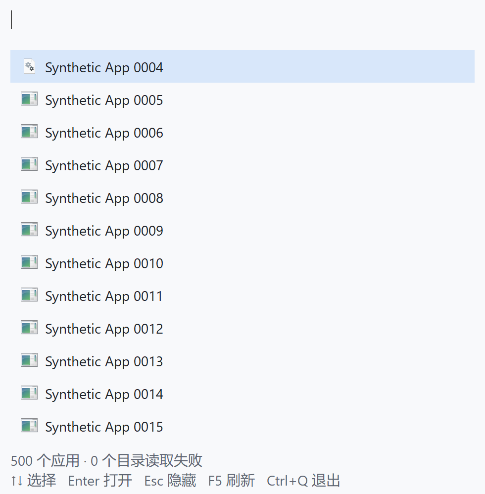

# 正式应用图标开关与性能

2026-10-03：将此前已测的优化图标方案加入正式 Rust + Win32 版本。现有托盘右键菜单提供“显示应用图标”，默认关闭、勾选表示开启，保存到数据目录的 `icons.txt`。没有增加设置窗口、依赖或后台周期轮询。

## 使用与资源生命周期

- `--icons on` / `--icons off` 仅覆盖本次启动；在托盘中切换才保存。设置缺失、无效或超长时默认关闭，独立于主题和英文输入设置。
- 切换立即重绘并保留输入、查询和结果选择。关闭时停止并等待工作线程、销毁待消费结果和可见图标快照、释放元数据与资源缓存；旧 READY 通知无法重新填入图标。
- 关闭启动不创建图标 Session/线程或解析、提取缓存。开启但隐藏启动也不创建线程；出现可见结果时才创建一个 STA 工作线程，空闲使用条件变量阻塞。
- 只加载最多 12 个可见结果。资源 HICON LRU 上限 48，另共享一个通用图标；元数据最多 512 条、保守字节账目最多 128 KiB。两份复用 UTF-16 工作缓冲另外占 128 KiB，不计入元数据预算；整个进程内存不是上述缓存预算。
- 图标按原样资源路径和索引共享，保留 `.lnk` 的自定义图标位置、环境变量和负资源 ID；解析失败/没有资源使用共享通用图标。应用启动仍使用原始入口，没有把 `.lnk` 改成裸 exe。
- F5/托盘刷新与 DPI 变化使缓存失效。图标完成只重绘图标列，无新增整屏位图缓冲。主题、选择、查询变化仍正常完整重绘。
- 系统图标提取本身不可在中途取消：关闭选项或退出需等正在执行的单次系统调用返回。没有通过清空工作集制造低内存结果，也没有跨进程像素缓存。

## 正式窗口验证

21 项单元/集成测试，以及 `cargo fmt --check`、`cargo clippy --offline --all-targets -- -D warnings`、`cargo build --release --offline` 通过。

`native_probe.exe --icons` 使用正式窗口和正常失焦隐藏行为，验证默认关闭、实际托盘菜单勾选/选择、隐藏时启用不加载、呼出只加载可见项、关闭保留查询并释放资源、20 次加载中启用/关闭、旧通知隔离、F5 缓存失效、重启保存。已有 Delete、粘贴后立即 Enter、结果选择、两种主题、英文布局恢复、注入 IME 按键交接、单实例、托盘恢复、热键冲突/释放和受控启动回归也通过。快捷方式只打开受控测试程序。

真实中文 IME（本机小狼毫/Rime）的最后一次独立复验 `native_probe.exe --icons --ime-real` 完整通过：真实英文按键、中文 Enter 确认/自动重复保护、空格选词后立即启动、第一次 Esc 取消/第二次隐藏、隐藏取消组合、重开后正常输入启动，以及菜单/保存/刷新/热键/受控启动等完整回归。前三次曾在真实按键期间因前台焦点变化中断，保留各次进度、不计作成功、不混入性能数据；没有放宽键盘注入的前台检查或修改正常输入法/失焦隐藏规则。功能探针第三轮 5 秒空闲观测出现 15.625 ms CPU 增量，不能把下方英文条件下的 2 秒零增量推广到所有 IME 状态。

## 最终同场性能

394 个真实入口，各 5 轮。以下是同场结果；“原型”指上一轮冻结的优化原型，不是未优化图标版本。

| 指标 | 原型关闭 | 正式关闭 | 原型开启 | 正式开启 |
| --- | ---: | ---: | ---: | ---: |
| 连续查询后私有提交 P50/P95 MiB | 4.32 / 4.34 | 4.32 / 4.35 | 5.25 / 5.47 | 5.91 / 6.05 |
| 连续查询后工作集 P50/P95 MiB | 26.50 / 26.55 | 26.46 / 26.52 | 28.58 / 28.86 | 28.73 / 29.16 |
| 累计私有提交峰值最大值 MiB | 4.34 | 4.35 | 14.03 | 14.28 |
| 累计工作集峰值最大值 MiB | 26.55 | 26.52 | 37.20 | 37.48 |
| 活动负载累计 CPU P50/P95 s | 8.63 / 9.06 | 7.78 / 8.92 | 13.11 / 13.77 | 12.84 / 14.28 |
| 查询与绘制 P50/P95 ms | 9.39 / 14.37 | 9.07 / 13.84 | 8.61 / 13.92 | 8.50 / 13.70 |
| 全部结果（含图标）就绪 P50/P95 ms | 9.51 / 14.46 | 9.17 / 13.96 | 13.76 / 37.08 | 13.72 / 38.38 |
| 内部完整 12 行绘制 P50/P95 ms | 3.43 / 4.54 | 3.50 / 5.04 | 4.26 / 5.77 | 4.29 / 5.74 |

关闭启动维持了本轮无图标基线：私有提交中位数差 −0.004 MiB、工作集差 −0.039 MiB，未出现图标线程、缓存或提取。开启组相对冻结优化原型，文字绘制与全部就绪中位数相近，私有提交中位数多 0.664 MiB、工作集多 0.152 MiB；不能称为完全相同内存。正式开启相对正式关闭，私有提交多约 1.59 MiB、工作集多 2.27 MiB，峰值私有提交多约 9.93 MiB，图标加载成本依然存在。

本轮**没有复现上一批约 5 ms 的绝对查询耗时**：冻结原型开启的文字绘制中位数也由 5.07 → 8.61 ms，活动 CPU 由 8.53 → 13.11 s。相同 exe 也变慢，当前数据不足以把跨批变化归因于图标开关或单一环境因素。统计完成后的系统 CPU 快照为 28%，电源方案为平衡；未连续记录每轮外部负载，不能拿该快照解释所有变动。本次支持“开关集成后与同场原型耗时相近”，不支持固定 5 ms 或所有低配机器均维持同一数字的承诺。

新进程启动与首次呼出也保留统计，没有把首次加载成本并入预热查询：

| 指标 P50/P95 | 原型关闭 | 正式关闭 | 原型开启 | 正式开启 |
| --- | ---: | ---: | ---: | ---: |
| 隐藏启动私有提交 MiB | 3.83 / 3.91 | 3.87 / 3.91 | 3.64 / 3.93 | 3.84 / 3.91 |
| 隐藏启动工作集 MiB | 22.40 / 22.57 | 22.52 / 22.56 | 22.36 / 22.66 | 22.42 / 22.54 |
| 从创建进程到发现自有窗口 s | 1.78 / 1.94 | 1.76 / 2.22 | 1.39 / 2.55 | 1.61 / 3.17 |
| 首次呼出到全部结果就绪 ms | 93.49 / 97.16 | 75.18 / 428.23 | 120.49 / 132.52 | 120.12 / 245.86 |

首次呼出计时包含文字绘制后的进程采样与图标等待，不能当作纯首屏绘制时间。隐藏启动阶段图标工作线程尚未创建；开启/关闭之间的启动波动不能归因于图标提取。这是新进程测量，系统磁盘缓存未清空。

## 开启后再关闭

正式开启组各轮完成 F5 后，关闭选项，再完成 200 个新查询。切换保留查询，图标线程退出，所有可见图标/解析/提取/缓存计数清零；后续查询不重启图标工作。真实样本总线程数从 10 回到 9。关闭操作耗时五轮为 6.916、4.467、8.777、4.258、4.115 ms，中位数 4.467 ms；这是已等待加载完成后的切换，不是慢资源调用中途取消的耗时承诺。

| 正式版本状态 | 全新启动即关闭 | 开启完成压力查询 | 开启后再关闭并查询 |
| --- | ---: | ---: | ---: |
| 私有提交 P50/P95 MiB | 4.32 / 4.35 | 5.91 / 6.05 | 5.18 / 5.31 |
| 工作集 P50/P95 MiB | 26.46 / 26.52 | 28.73 / 29.16 | 28.66 / 28.70 |
| 查询与绘制 P50/P95 ms | 9.07 / 13.84 | 8.50 / 13.70 | 10.17 / 14.97 |
| 图标加载线程 / 自有缓存 | 无 | 有，上限受控 | 无 |

关闭后私有提交下降，但完整进程工作集未回到全新关闭状态。系统组件、分配器/图形缓存仍可能保留已加载页；没有做完整归因，也没有清空工作集。关闭之后的查询时段和 F5 后状态与新进程有差异，不能宣称关闭恢复全部内存或耗时完全相同。峰值是进程生命周期历史最大值，关闭后不会下降。

## 合成样本与纯搜索

500 项合成 GUI 样本，各 3 轮：

| 指标 | 原型关闭 | 正式关闭 | 原型开启 | 正式开启 |
| --- | ---: | ---: | ---: | ---: |
| 私有提交 P50/P95 MiB | 2.33 / 2.42 | 2.65 / 2.71 | 3.26 / 3.34 | 3.41 / 3.53 |
| 工作集 P50/P95 MiB | 17.94 / 17.95 | 18.00 / 18.03 | 19.73 / 22.22 | 19.82 / 19.89 |
| 累计私有提交峰值最大值 MiB | 2.54 | 2.81 | 4.59 | 4.64 |
| 活动 CPU P50/P95 s | 6.19 / 7.08 | 5.64 / 6.44 | 6.09 / 7.94 | 6.38 / 6.83 |
| 查询与绘制 P50/P95 ms | 7.94 / 12.07 | 5.80 / 8.33 | 5.09 / 9.19 | 6.21 / 8.75 |
| 全部结果就绪 P50/P95 ms | 8.04 / 12.36 | 5.89 / 8.43 | 7.32 / 12.42 | 8.68 / 11.69 |

合成开启组的中位查询/图标就绪耗时比同场原型增加约 22% / 19%，P95 并未一起增加，少量样本和时段波动不能排除。共享缓存的提取数和边界检查通过，不能据此称所有负载都完全维持原型速度。真实与合成共 32 个性能进程全部正常退出；全部 2 秒空闲 CPU 观测均为 0 ms，仅是本次观测。

图标关闭与开启不改变搜索、拼音或排名代码。GUI 测量结束后独立运行 3 次 `search_bench`，固定一个 CPU 核；各规模构建、首次查询、预热 20×12、测量 100×12=1200 次。以下取三次中位数：

| 项数 | 构建 ms | 首次搜索 µs | 预热 P50/P95 ms | 三次 P95 范围 ms | 索引自有容量字节 |
| --- | ---: | ---: | ---: | ---: | ---: |
| 500 | 0.6545 | 31.4 | 0.0233 / 0.0420 | 0.0413–0.0466 | 121,074 |
| 2,000 | 2.3910 | 139.8 | 0.0965 / 0.1819 | 0.1590–0.2172 | 488,874 |
| 10,000 | 13.0534 | 694.7 | 0.6005 / 1.2121 | 1.1391–1.8376 | 2,461,674 |

这些是纯核心数据，排除图标加载/绘制、发现、IME 和消息队列竞争；不代表完整产品内存或有后台图标任务时的按键延迟。



## 环境与测量方法

本机 Intel i7-11700K（8 核/16 线程）、32 GiB、Windows 11 企业版 build 26200 x64。Rust 1.95.0 MSVC，release opt-level=3、fat LTO、codegen-units=1、panic=abort、strip、静态 CRT、离线构建。无第三方 Rust crate。MiB = 1,048,576 字节。

四种配置轮换执行：冻结的优化原型关闭/开启图标、正式版本关闭/开启图标。真实来源 394 个入口，每种 5 个独立进程；合成来源 500 个受控入口，每种 3 个独立进程。合成样本只有两组主要资源（无自有图标的测试 exe 与一个自定义 Windows 资源），适合验证共享/负缓存，不能推广到 500 个不同真实图标。整个批次核对目录索引 SHA256 一致，真实名称/路径不导出到报告。

每个进程隐藏启动后等 100 ms 采样、首次显示并等图标；列表绘制预热 20 次，外部/内部各计时 200 次；内部计时通过 WM_PAINT 正常绘制。随后完成 200 个名称查询、同一查询预热 20 次并计时 120 次、1000 次快速轮换并等待最后结果。正式开启组还验证 F5，再关闭图标，预热 20 次、计时 200 次关闭后的新查询，检查线程/缓存/提取不再出现。最后隐藏等 500 ms，再观察 2 秒空闲。

性能探针使用正式 exe 的 `--measure-icons --hold-measurement-window`，只在测量时抑制失焦隐藏，与冻结原型的测量条件相同。全局热键和正常 Edit 按键仍有效；正常运行没有这两个参数。真实窗口/菜单/IME 回归不使用保持显示参数。窗口计时包含同步 Edit、搜索、消息 IPC 和 GDI 绘制，**不是物理按键到屏幕时间**。

CPU 为全部应用线程的累计处理器时间，活动区间为隐藏采样至 1000 查询结束，不是持续占用百分比。私有提交、工作集和峰值取被测完整进程（包括系统组件），排除驱动和 Explorer 等其他进程，不是整个系统增量。对照表峰值取查询压力阶段累计峰值的组内最大值；F5、关闭后的额外验证另列。每次是新进程内图标缓存，没有清空系统文件缓存，不能称为磁盘冷启动。

P50/P95 使用最近秩；内存取进程间 P50/P95，n=5/n=3 时 P95 为最大值。重复查询先算每进程 P50/P95 再取组中位数；启动/首次显示直接取独立进程间分位。少量样本没有做统计显著性检验，不能解释小波动为普遍收益。纯搜索独立测 500/2000/10000 项，与完整窗口/进程指标分开报告。

## 重现与证据

构建和测量工具：

```powershell
cargo fmt --check
cargo test --offline
cargo clippy --offline --all-targets -- -D warnings
cargo build --release --offline
# 保留此前的 runtime/icon-eval/optimized；可参照 ICON_CACHE_RESULTS.md 重建冻结原型。
pwsh -File tools/measure_icon_switch.ps1 -Real -Runs 5 -ValidateCache -Output switch-real-repro
pwsh -File tools/measure_icon_switch.ps1 -Runs 3 -ValidateCache -Output switch-synthetic-repro
pwsh -File tools/summarize_icon_switch.ps1 -RealDataset switch-real-repro -SyntheticDataset switch-synthetic-repro
target/release/search_bench.exe
# Windows GUI 程序需 Start-Process -Wait 等待 native_probe 完整结束。
Start-Process target/release/native_probe.exe -ArgumentList '--icons' -WindowStyle Hidden -Wait
```

正式 exe 为 714,752 字节，SHA256 `E5F412D4923E9DD06B1F43A13A69D50FC425202EF122103BA313E1728BBE7AC8`。冻结优化原型 exe SHA256 `17B559CD082D9B877E4D4A0715BAB8F46E1E400D1808DE099A706FCA3D43F932`。图标算法来源为本项目独立原型，没有复制其他项目代码。

最终原始数据为忽略目录 `runtime/icon-eval/switch-real-final` 和 `switch-synthetic-final`，汇总为 `switch-comparison.json`；已通过的普通窗口回归另存 `runtime/icon-switch/accepted-window-probe`，实际中文 IME 完整窗口回归另存 `runtime/icon-switch/accepted-ime-window-probe`（原路径 `runtime/probe-icons-controlled`）；纯搜索为 `runtime/icon-switch/search-1..3.txt`。前一次 `switch-real-verified` 因正常失焦隐藏中断，是未完成批次，不混入最终统计；`switch-smoke` 仅用于初步通路检查。实际中文 IME 的前三次前台中断进度为 `runtime/icon-switch/ime-first-attempt.txt`、`ime-second-attempt.txt` 和 `ime-third-attempt.txt`。

Windows 10、x86、极低配、慢/网络图标资源和低内存换页仍未实测。图标开关默认关闭，不承诺图标提取峰值或真实 IME/Shell 加载的系统组件成本已经解决。
