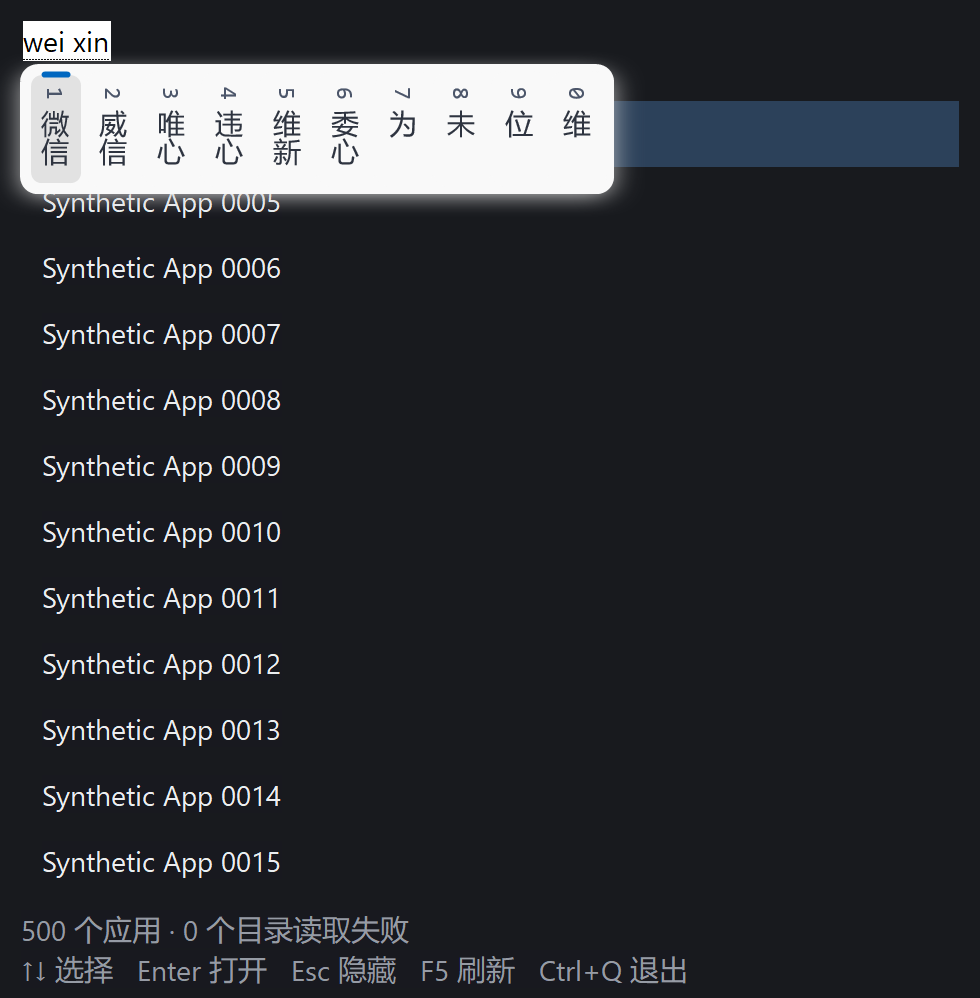

# 原生 IME 支持与验证

本文记录此前 IME 构建与测量。后续已加入默认关闭的托盘英文输入开关，当前构建、设置和对照结果见 [ENGLISH_INPUT_RESULTS.md](ENGLISH_INPUT_RESULTS.md)。下文“没有添加强制英文选项”描述的是此前构建。

2026-10-03：参考 Flow Launcher 的标准文本控件与输入事件处理方式，完善 PicoRun 的原生 Edit/IMM 按键交接。真实小狼毫/Rime 输入已通过，确认文字不会误启动应用，取消组合不会残留到下一次呼出。没有新增第三方 Rust crate。实际输入法加载后占用明显增加，低内存目标仍有缺口。

## Flow Launcher 的参考结论

参考官方仓库 dev 提交 `5a7519a03327d0eef926d1d8703aa5dbfa88305a`（2026-09-30T20:23:22Z），只读研究，没有导入其代码或 WPF 依赖。

- 输入框是 WPF TextBox；`TextChanged` 读取控件实际 Text 更新查询，`PreviewKeyUp` 在绑定与控件不一致时补同步。[输入框](https://github.com/Flow-Launcher/Flow.Launcher/blob/5a7519a03327d0eef926d1d8703aa5dbfa88305a/Flow.Launcher/MainWindow.xaml#L250)、[文字变化](https://github.com/Flow-Launcher/Flow.Launcher/blob/5a7519a03327d0eef926d1d8703aa5dbfa88305a/Flow.Launcher/MainWindow.xaml.cs#L1526)、[KeyUp](https://github.com/Flow-Launcher/Flow.Launcher/blob/5a7519a03327d0eef926d1d8703aa5dbfa88305a/Flow.Launcher/MainWindow.xaml.cs#L1458)
- Enter/Escape 使用 WPF KeyBinding，方向键处理判断 `e.Key`。WPF 把 IME 输入标记为 `Key.ImeProcessed`，原始键在 `ImeProcessedKey` 中。据源码和 WPF 文档推断，普通快捷键识别依靠框架的输入分类；不能把它说成 Flow 自己实现了一套 Win32 组合状态机，也没有对 Flow 做运行时差分验证。[KeyBinding](https://github.com/Flow-Launcher/Flow.Launcher/blob/5a7519a03327d0eef926d1d8703aa5dbfa88305a/Flow.Launcher/MainWindow.xaml#L54)、[方向键](https://github.com/Flow-Launcher/Flow.Launcher/blob/5a7519a03327d0eef926d1d8703aa5dbfa88305a/Flow.Launcher/MainWindow.xaml.cs#L470)、[WPF 输入文档](https://learn.microsoft.com/en-us/dotnet/desktop/wpf/advanced/input-overview#text-input)
- Flow 另有 AlwaysStartEn：转换器设置首选 IME 状态/转换模式，显示时可切到英文布局。PicoRun 本次保留用户选择的输入法与模式，没有添加强制英文选项。[转换器](https://github.com/Flow-Launcher/Flow.Launcher/blob/5a7519a03327d0eef926d1d8703aa5dbfa88305a/Flow.Launcher/Converters/BoolToIMEConversionModeConverter.cs)、[显示逻辑](https://github.com/Flow-Launcher/Flow.Launcher/blob/5a7519a03327d0eef926d1d8703aa5dbfa88305a/Flow.Launcher/ViewModel/MainViewModel.cs#L2359)

## PicoRun 的实现

`platform/windows/ime.rs` 保存组合状态、候选列表位掩码和少量按键的归属；没有堆分配、定时器或后台线程。原生 Edit 继续处理文字、转换、光标和候选界面。

1. 消息循环在 TranslateMessage 前识别 `VK_PROCESSKEY`，通过 ImmGetVirtualKey 恢复原始键。组合已经结束时，确认键仍可能在消息队列里；不能仅靠一个 composing 布尔值判断 Enter 是否可启动。[ImmGetVirtualKey](https://learn.microsoft.com/en-us/windows/win32/api/imm/nf-imm-immgetvirtualkey)
2. 输入法使用过的 Enter/Esc/上下键/F5/Ctrl+Q 的 Q 保留归属到 KeyUp。处理 WM_IME_KEYDOWN/KEYUP，避免旧式 IME 转发的普通键被再次解释为启动器命令。尚在组合或候选列表内时，原始控件先处理按键。[WM_IME_KEYDOWN](https://learn.microsoft.com/en-us/windows/win32/intl/wm-ime-keydown)
3. 组合/候选结束后补投递合并查询；组合期间不改结果布局，正常 EN_CHANGE 仍读取真实控件文字。执行应用前同步查询，空格选词后不要求额外确认一次。
4. 隐藏和重新显示时取消本 Edit 的组合并清理状态；焦点丢失后清理残留。IMM 调用前释放 Runtime 借用，HIMC 获取/释放成对。[ImmNotifyIME](https://learn.microsoft.com/en-us/windows/win32/api/imm/nf-imm-immnotifyime)
5. 将 renderer 字体的 LOGFONT 同步给 IME，沿用输入框字体与 DPI；结构在栈上，IMM 同步复制。候选布局/样式继续遵循输入法设置。[ImmSetCompositionFontW](https://learn.microsoft.com/en-us/windows/win32/api/immdev/nf-immdev-immsetcompositionfontw)

## 功能验证与产物

最终 `target/release/picorun.exe` 为 **635,392 字节**，SHA256 `4E6456FCB1C1E5C9ABD5D43AACA2D3FF69E8D9C498EECAFBD1064EB0DD7B1B77`。14 项单元/集成测试通过；`cargo fmt --check`、`cargo clippy --offline --all-targets -- -D warnings`、`cargo build --release --offline` 和 `git diff --check` 通过。

交付时已用默认数据目录恢复运行，确认窗口可见、Shell 能查询到托盘图标；以 `--theme light` 临时展示亮色，保存的主题选择不变。

`native_probe --ime-real` 使用 500 个合成快捷方式，启动的都是受控程序。最终 release 通过：

- 注入“组合结束早于确认键到达”、按住 Enter 的重复消息、旧式 WM_IME_KEYDOWN 转发与释放、两组候选掩码部分关闭、候选方向键不改应用选择、Esc 与隐藏/重开状态恢复。
- 本机真实键盘输入 `weixin`，候选窗口出现；上下键操作交给输入法。Enter 提交 `weixin`，按住/重复 Enter 不启动；松开后新按 Enter 启动对应受控入口。
- 空格选出 `微信`，下一次 Enter 直接启动；第一下 Esc 取消组合且窗口保留，下一下 Esc 隐藏。
- 真实组合时隐藏，再呼出后输入另一查询，Enter 正常启动。测试结束恢复测试窗口原输入布局、打开状态与转换模式。
- 原有 Delete、Copy/Paste、立即 Enter、快捷方式参数/工作目录、失效入口、F5、托盘/主题、缓存恢复、单实例、热键冲突及释放、1000 次查询回归通过。

实际简体中文 HKL 为 `0x8040804`，进程加载 `weasel.dll`，确认是本机小狼毫/Rime；没有安装或更改输入法配置。截图中的竖排候选来自现有 `vertical_text: true` 配置，保留该选择。其候选布局选项见[小狼毫官方文档](https://github.com/rime/weasel/wiki/Weasel-%E5%AE%9A%E5%88%B6%E5%8C%96)。本次未取得 DLL 版本，不把这一结果等同微软拼音、日语、韩语或其他输入法全部通过。

组合截图取当前前台测试窗口的实际屏幕区域；PrintWindow 无法完整捕获外部 IME 窗口。只保存合成应用界面，无个人应用清单。

## 测量口径

i7-11700K，8 核/16 线程，32 GiB；Windows 11 Enterprise 25H2 build 26200，x64；Rust 1.95.0 MSVC；opt-level=3、fat LTO、codegen-units=1、panic=abort、strip、静态 CRT，离线 release。MiB = 1,048,576 字节。

普通 GUI 的 500 合成/394 真实目录各 5 个独立进程；首次应用缓存缺失，第二次损坏，后三次有效，每次仍完整发现入口。没有清空系统文件缓存，不称为磁盘冷启动。每进程预热 20 次输入，测 120 次六种查询。启动观察约 5 ms 轮询。真实目录只查询，不打开用户应用。

内存为完整 PicoRun 进程的 PrivateUsage/WorkingSetSize，峰值为进程创建以来 PeakPagefileUsage/PeakWorkingSetSize。包含已加载的 Windows/输入法/显卡组件，排除测量器、受控子程序、Explorer 和外部输入法服务，不是全系统增量。没有清空工作集。下表为五进程中位数（最小–最大），阶段采样在真实键盘 IME 测试之前。

## 完整进程内存

| 来源与阶段 | 私有提交 MiB | 工作集 MiB |
| --- | ---: | ---: |
| 500 合成 · hidden | 2.10（2.07–2.11） | 15.66（15.61–15.67） |
| 500 合成 · shown | 3.09（2.32–3.10） | 20.86（17.02–20.88） |
| 500 合成 · input | 3.11（2.24–3.11） | 21.24（17.14–21.29） |
| 500 合成 · refreshed | 3.20（2.36–3.28） | 21.40（17.31–21.46） |
| 500 合成 · idle_end | 3.11（2.36–3.18） | 21.43（17.31–21.47） |
| 394 真实 · hidden | 3.62（3.38–3.72） | 21.63（21.61–21.72） |
| 394 真实 · shown | 3.88（3.68–3.97） | 23.11（23.07–23.21） |
| 394 真实 · input | 3.90（3.71–4.00） | 23.21（23.17–23.29） |
| 394 真实 · refreshed | 3.96（3.73–3.96） | 23.34（23.31–23.38） |
| 394 真实 · idle_end | 3.96（3.73–3.96） | 23.34（23.31–23.38） |

500 合成全场景包含 Shell 启动、真实 IME、主题和查询压力，最大峰值提交 **106.73 MiB**、工作集 **116.80 MiB**。真实 IME 测试后，当前私有提交 **71.27 MiB**、工作集 **77.91 MiB**。394 项真实目录只查询的峰值是 **4.20 / 23.57 MiB**；不能拿这两个场景互相替代。

另取 **1 个独立进程**，用相同 500 项来源，只输入与选词，再向自身窗口发送失焦消息隐藏，全程不发 Enter 或启动命令，得到以下隔离观察。n=1 不给统计 P50/P95，也不推断所有输入法的成本。

| 仅真实 IME 查询的阶段 | 私有提交 MiB | 工作集 MiB |
| --- | ---: | ---: |
| 输入前显示 | 3.12 | 21.21 |
| `weixin` 组合中 | 65.02 | 56.00 |
| 空格提交后 | 64.92 | 56.07 |
| 隐藏并空闲后 | 64.92 | 56.09 |

该进程峰值 **66.09 / 56.99 MiB**。加载模块包括 weasel、TSF、DirectWrite、D2D/D3D 和显卡驱动；仍需分配跟踪才能细分责任，不能把整个增量直接归于某个 DLL。该结果说明 Shell 启动不能解释全部增长，也说明真实输入后未达到“显示私有提交低于 8 MiB”的探索目标。下一步应优先定位完整 IME/驱动常驻成本与 Shell 启动峰值。

1000 次查询前后当前私有提交 **71.75→71.75 MiB**，工作集 **78.32→78.32 MiB**，GDI **37→37**，USER **40→38**；只是一轮压力观察。普通阶段隐藏稳定 1 秒后测 5 秒 CPU：合成 5 次均 0 ms，真实目录为 0、15.625、0、0、0 ms；隔离 IME n=1 为 0 ms。主循环阻塞 GetMessage，不把这些观察解释为普遍零 CPU。

## 原生窗口响应

| 来源 | 启动 P50/P95 ms | 首次显示 P50/P95 ms | 输入 P50/P95 中位数 ms | 各进程输入 P95 范围 ms |
| --- | ---: | ---: | ---: | ---: |
| 500 合成 | 276.99 / 309.85 | 43.62 / 57.37 | 3.69 / 6.18 | 5.59–11.63 |
| 394 真实 | 473.52 / 502.75 | 21.99 / 24.05 | 5.03 / 7.70 | 6.87–9.44 |

启动/显示各 n=5，P95 为最近秩最大值。输入是各进程分位数的中位数，未合并样本；计原生 Edit 文本更新、同步搜索、布局、GDI 绘制及跨进程消息成本。物理按键、IME 候选生成和桌面合成不在该计时内。真实按键用于功能验收，测试有主动输入/稳定等待，未测物理按键到像素的 P95。桌面负载存在波动，没有交错配对旧版，不宣称变快。

## 纯搜索：500 / 2000 / 10000

固定第一个可用 CPU，5 个独立基准进程；每规模预热 20×12 查询，正式每进程 100×12 = 1200 样本。只计 search，排除发现、拼音准备、GUI/IME 和启动。表取各进程分位数中位数，P95 使用最近秩；搜索排名与字典未修改。

| 项数 | P50 ms | P95 ms | P95 范围 ms | 索引构建中位数 ms | 索引拥有容量 bytes |
| --- | ---: | ---: | ---: | ---: | ---: |
| 500 | 0.0218 | 0.0540 | 0.0502–0.0605 | 0.6784 | 121074 |
| 2000 | 0.0965 | 0.2505 | 0.2417–0.2692 | 2.7339 | 488874 |
| 10000 | 0.5516 | 1.2543 | 1.1938–1.6392 | 14.0630 | 2461674 |

预热前首次搜索的五次中位数为 24.9 / 112.8 / 728.3 µs，各进程/规模只有一个首次样本，不称为冷搜索 P95。搜索核心数字不能代替完整进程占用或窗口响应。

## 记录与待验证范围

原始记录在忽略的 `runtime/`：`probe-controlled/{checks.txt,memory.csv,timings.txt}`、`probe-real/{checks.txt,memory.csv,timings.txt}`、`probe-ime-query-visual/{checks.txt,memory.csv,composition.png}`、`ime-query-probe.ps1`、`search-bench-ime-1..5.txt`；Flow 参考与固定版本 metadata 在 `flow-reference/`。中途失去前台焦点而中断的辅助重复测量不计入隔离结果。真实入口、缓存与个人输入法配置没有提交。

微软拼音、其他 IME、真实候选鼠标选词、多显示器跨 DPI、Windows 10、x86、低内存换页实机仍待验证。此前托盘/主题结果保留在 [TRAY_THEME_RESULTS.md](TRAY_THEME_RESULTS.md)，首版基线在 [NATIVE_RESULTS.md](NATIVE_RESULTS.md)。
