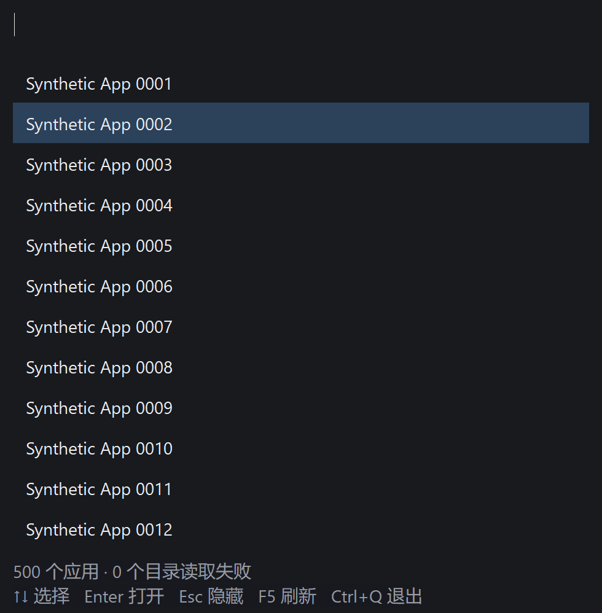
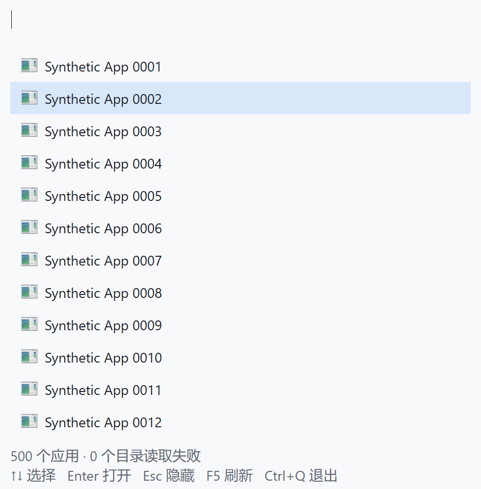

# 上下键选择重绘与闪烁修复

2026-10-04。此前上下键即使没有改变选中项，也调用整窗失效；GDI 在可见窗口先填充背景，再逐行画字，存在列表文字暂时被清掉的阶段。现改为只使旧、新选中行失效，边界和无结果按键不重绘；用可复用的单行位图完成背景、图标和文字，再复制到窗口。鼠标选择沿用同样的局部更新。隐藏释放位图和内存 DC，没有新增线程、计时器或依赖。

## 实现与验证

原生 Edit、实际文本同步、IME 组合/候选保护不变；方向键只改选择，不再请求相同的图标列表。绘制按更新区域裁剪，图标完成仍只更新图标列。字体在绘制后恢复；位图先从 DC 取消选择，再释放。缓冲创建失败仍有直接绘制回退。

补齐 `WM_PRINTCLIENT`：系统快照使用传入的 DC 绘制完整客户区，不把没有更新区域的快照请求当作普通局部绘制。捕获探针读取 DIB 像素前同步 GDI。规则依据微软的 [InvalidateRect](https://learn.microsoft.com/en-us/windows/win32/api/winuser/nf-winuser-invalidaterect)、[CreateCompatibleBitmap](https://learn.microsoft.com/en-us/windows/win32/api/wingdi/nf-wingdi-createcompatiblebitmap)、[WM_PRINTCLIENT](https://learn.microsoft.com/en-us/windows/win32/gdi/wm-printclient) 和 [CreateDIBSection](https://learn.microsoft.com/en-us/windows/win32/api/wingdi/nf-wingdi-createdibsection) 文档。

`native_probe.exe --flicker`：修复版 12 个进程通过 9,888 条断言，另记 12 段空闲 CPU 观察。亮/暗 × 图标开/关，每组合 3 次；连续按键共 4,800 次。检查首次上/下键、空查询、已有查询、无结果、底部边界、重开、实际热键与键盘，以及模拟 96/144/192 DPI 后的局部重绘和单行大小。截图验证文字、图标、选中背景和页脚正确。

本机 175% 缩放下，旧版首次上键和下键都使 `980×998` 客户区失效。修复后首项上键的区域为空，下键区域为 `(21,101)–(959,233)`，仅两行；包围面积从 978,040 降到 123,816 像素，减少 87.34%。两版箭头期间 Edit 的失效/绘制计数均为零；这里定位的是列表重画，不能把旧版行为描述成每次重画 Edit。

`cargo test --offline`：20 个单元测试及 5 个搜索流程测试通过；`cargo fmt --check`、`cargo clippy --offline --all-targets -- -D warnings`、`cargo build --release --offline` 通过。搜索核心没有修改，本次没有重测核心 500/2000/10000 项基准或实际中文 IME 完整套件，既有结果仍分别见 [ICON_SWITCH_RESULTS.md](ICON_SWITCH_RESULTS.md) 和 [IME_RESULTS.md](IME_RESULTS.md)。

## 选择绘制耗时

机器：i7-11700K、32 GiB、Windows 11 企业版 x64 build 26200；Rust 1.95.0 MSVC。release 优化等级 3、fat LTO、单 codegen unit、panic abort、strip、静态 CRT。500 个合成 `.lnk`，只搜索不打开；英文输入开关启用，图标为合成程序的通用回退。固定主屏幕位置与 175% 缩放，不绑定 CPU 核。每配置首进程删除应用缓存、后两个保留缓存；没有清理 OS 缓存，不代表冷磁盘。先完成首屏和图标加载、发送首上/下键，然后各测 200 次空查询与已有查询；不额外预热。

旧版使用提交 `4811c81` 的绘制逻辑，加上与新版本相同的显式测量接口，冻结为 `runtime/flicker/reference-instrumented.exe`（SHA-256 `88B67E1A034E12B2A0D09F4D84823470000072A4E1696965F54ED08405EF36D2`）。参考 12 个进程后测试修复 12 个进程，未随机交错；背景负载和测试顺序可能影响绝对耗时。

每格为 P50 / P95 毫秒，nearest-rank；每行每版本 600 次（200 键 × 3 个进程）合并统计。

| 配置 | 查询 | 修复前 | 修复后 |
| --- | --- | --- | --- |
| 暗色、图标关 | 空 | 2.0159 / 2.9641 | 0.2425 / 0.4264 |
| 暗色、图标关 | 已有文字 | 1.9833 / 3.1621 | 0.2476 / 0.4418 |
| 暗色、图标开 | 空 | 2.6028 / 4.2003 | 0.3184 / 0.5597 |
| 暗色、图标开 | 已有文字 | 2.6676 / 4.0401 | 0.3451 / 0.7727 |
| 亮色、图标关 | 空 | 2.3074 / 3.9802 | 0.2521 / 0.4299 |
| 亮色、图标关 | 已有文字 | 2.1870 / 3.1603 | 0.2665 / 0.6020 |
| 亮色、图标开 | 空 | 2.4066 / 3.7174 | 0.3175 / 0.5944 |
| 亮色、图标开 | 已有文字 | 2.3609 / 3.4430 | 0.3026 / 0.5591 |

计时从探针同步发送请求，到原生 Edit 的按下/释放、读取更新区域及立即绘制完成；不包含真实按键投递、桌面合成和屏幕扫描。它是选择绘制探针，**不是搜索核心耗时，也不是实际键盘到屏幕 P95**。

## 完整进程内存成本

下表在 400 次连续选择后、截图和模拟 DPI 操作前采样，每格为 3 个完整进程的中位数，单位 MiB。私有提交与工作集分别统计，不能用位图像素数替代完整进程数据。

| 配置 | 私有提交 前→后 | 工作集 前→后 | 累计私有峰值 前→后 | 累计工作集峰值 前→后 |
| --- | --- | --- | --- | --- |
| 暗色、图标关 | 2.426 → 3.125 | 18.020 → 22.113 | 2.520 → 3.129 | 18.023 → 22.117 |
| 暗色、图标开 | 2.641 → 3.395 | 18.426 → 22.477 | 2.801 → 3.398 | 18.441 → 22.480 |
| 亮色、图标关 | 2.430 → 3.145 | 18.047 → 22.121 | 2.512 → 3.172 | 18.074 → 22.125 |
| 亮色、图标开 | 2.688 → 3.398 | 18.379 → 22.480 | 2.762 → 3.402 | 18.391 → 22.484 |

本轮私有提交增加约 0.70–0.75 MiB，工作集增加约 4.05–4.10 MiB。额外内存的完整归因尚未确定；早一轮兼容位图测试的增量较小（私有约 0.07–0.22 MiB、工作集约 2.4 MiB），不能选用较好的那一轮当作最终成本。单行位图在本屏幕为 `980×66`，32 位像素约 252.7 KiB，另有 1 个 bitmap 和 1 个 DC；可见阶段 GDI 计数恰好增加 2。隐藏后自有缓冲计数为零，但系统/分配器驻留不一定返回到全新进程状态，不清空工作集。

额外尝试固定格式 DIB 行缓冲，早期同类样本私有增量约 0.95–1.02 MiB、工作集约 4.46–4.57 MiB，未获得更低占用，未采用。图标、输入上下文和字体等完整路径仍有成本；本修复没有解决之前真实 IME/Shell 的大峰值。

包含随后截图、模拟 DPI 和重开步骤的所有采样中，旧/新最大累计私有峰值为 2.969 / 3.445 MiB，工作集峰值为 18.453 / 22.676 MiB；两版后续步骤不同，不能把这对最大值当作缓冲的增量。私有提交取 `PrivateUsage`，工作集取 `WorkingSetSize`，峰值取采样时累计的 `PeakPagefileUsage` / `PeakWorkingSetSize`。

每进程最后隐藏后间隔 1 秒记录 CPU：参考 12 段均为 0 ms；修复 10 段为 0 ms、2 段为 15.625 ms。未增加自有轮询，但不能从短时采样承诺一直零 CPU。早一轮出现过 31.25 ms，保留为观察记录，未把它当作选择正确性失败或隐藏掉。

## 复现与限制

构建后执行 `target\release\native_probe.exe --flicker`。`--flicker --reference` 需要上述冻结参考 exe 及其 `--measure-icons` 测量接口（`0x800b` 发送 Edit 键并读取区域/绘制，`0x800c` 返回区域、选择和几何）；不能把未加接口的官方旧 exe 直接作为参考。汇总：`powershell -File tools/summarize_flicker.ps1`。原始 `responses.csv`、`memory.csv`、断言/观察、冻结 exe、失败日志与系统信息均在忽略的 `runtime/flicker/`，来源全部是合成应用。

修复测试曾因未取得前台焦点、错误假设空查询重开必定回首项、读取尚未完成首次显示的窗口而失败；调整验收同步/期望后完整通过，旧记录保留。截图现在放在主要绘制/内存采样后，明确分开截图路径的额外成本。

通过范围是本机 Windows 11 x64 的原生窗口，不等同于 Windows 10、32 位、低内存换页、多显示器实机全组合或高速摄像验证。可运行 exe 为 `target\release\picorun.exe`，729,088 字节，SHA-256 `4FAFE8FF65ADD145942F077C09D13C09292AA2B97590E42F02AFB2E904055D80`。本次先提交的自启动版本为 `4811c81`；本修复仍保留在工作区。
