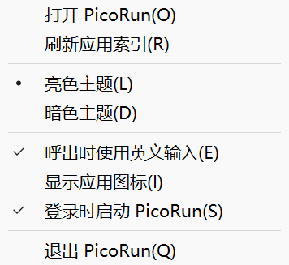

# 登录自启动验证

2026-10-04。此前没有自启动注册。本次实现默认关闭的托盘开关“登录时启动 PicoRun”，没有增加设置窗口、依赖、常驻线程或计时器。

## 注册行为

- 仅使用 `HKCU\Software\Microsoft\Windows\CurrentVersion\Run` 下的 `PicoRun` 字符串值；当前用户可注册，无需管理员权限。普通启动不创建或改写此项，只有明确切换托盘选项时写入/删除。
- 勾选时写入当前 exe 的绝对路径、`--hidden`、当前热键，以及显式 `--data-dir` / `--source` 的绝对目录。登录后启动到托盘，主题/英文输入/图标使用各自保存的设置，临时覆盖和验证参数不写入启动命令。
- UTF-16 参数按 Windows 命令行规则处理引号、空格和末尾反斜杠。启用前检查整个命令不超过 260 个 UTF-16 单元（不计结尾 NUL）；过长时保留原值并显示错误。
- 菜单每次打开读取真实注册表；取消只删除 `PicoRun` 值，值/键不存在时也成功。菜单勾选表示注册命令与当前配置一致，移动 exe 或更改热键/显式目录后，需重新启用更新命令。
- 注册句柄即时关闭，缓冲有界；注册、读取失败会显示状态。Win32 调用期间不保留 Runtime 的可变借用。

微软的 [Run / RunOnce 文档](https://learn.microsoft.com/en-us/windows/win32/setupapi/run-and-runonce-registry-keys) 明确了每用户登录注册位置、命令长度和可能延迟执行的行为；实现使用 [RegSetValueExW](https://learn.microsoft.com/en-us/windows/win32/api/winreg/nf-winreg-regsetvalueexw) 保存包含末尾 NUL 的 `REG_SZ`，按 [RegQueryValueExW](https://learn.microsoft.com/en-us/windows/win32/api/winreg/nf-winreg-regqueryvalueexw) 返回的实际长度读取，不假设字符串必定有 NUL。

## 已通过的验证

`cargo test --offline`：20 个单元测试和 5 个搜索流程测试通过。新增测试覆盖 Windows 参数解析的往返、Unicode/空格/引号/末尾反斜杠、注册/取消的幂等性、260 单元边界及过长拒绝、不同命令的勾选、取消时保留其他值，以及缺少 NUL、错误类型、奇数字节、NUL 后额外内容和超过读取上限的注册值。使用真实 API 和固定非 Run 隔离项，测试释放句柄并清理自己的项。

`native_probe.exe --startup`：24 条验收通过，启动 3 个独立受控 PicoRun 进程。首进程通过实际原生 popup 的 `S` 快捷键启用/取消，读取勾选并截图；验证不显示隐藏窗口、保留查询和独立设置，以及注册表外部变化在下次菜单体现。退出后注册保留，第二个进程正确读取勾选并取消，再连续切换 20 对。第三个进程直接执行保存的命令，验证隐藏窗口、Shell 托盘和 500 项来源/数据目录。三个进程正常关闭，探针检查真实 Run 值前后完全相同，并清理隔离叶项。

首次探针因期望路径未统一 Windows 分隔符而失败；修正验收期望为绝对路径后完整通过，没有改变应用的命令构造。失败记录保留在忽略目录。首次沙箱测试不能写注册表；在交互用户环境执行隔离测试通过。

构建检查：`cargo fmt --check`、`cargo clippy --offline --all-targets -- -D warnings`、`cargo build --release --offline` 通过。release 使用优化等级 3、fat LTO、单 codegen unit、panic abort、strip 和静态 CRT。Rust 1.95.0，`x86_64-pc-windows-msvc`。新 exe 为 724,480 字节（原图标开关版 714,752 字节，增加 9,728 字节）。SHA-256：`45D5980A8F69C7461D91D0F825C92B8785554053476E54625BCC6A3589375E34`。

## 完整进程采样与统计口径

机器：i7-11700K、32 GiB、Windows 11 企业版 x64、10.0.26200。500 个合成 `.lnk` 入口，图标关闭、英文输入开启、亮色；没有打开索引应用。首进程删除应用缓存后启动，后两个保留缓存；均未清理 OS 文件缓存，不代表真正冷磁盘。没有额外预热，每个进程在 Edit 已创建后采样，完成该轮交互后再隐藏，间隔 1 秒采样 CPU。未绑定 CPU 核。

| 受控进程 | 起始至 Edit 就绪 | 初始隐藏私有提交 / 工作集 | 本轮后隐藏私有提交 / 工作集 | 累计私有提交峰值 / 工作集峰值 |
| --- | --- | --- | --- | --- |
| 0：无应用缓存，菜单/查询/开关 | 276.67 ms | 2.195 / 16.363 MiB | 2.508 / 18.555 MiB | 2.605 / 18.625 MiB |
| 1：缓存，重新取消与 20 对切换 | 293.38 ms | 2.176 / 16.363 MiB | 2.492 / 17.715 MiB | 2.523 / 18.207 MiB |
| 2：缓存，直接执行存储命令 | 285.63 ms | 2.289 / 16.426 MiB | 2.289 / 16.434 MiB | 2.371 / 16.434 MiB |

上述是功能验收采样，没有同场旧版本 A/B，不能推导新增自启动的常驻增量，也不能与此前持续查询/IME/图标数据直接比较。三次启动只各测一次：混合场景的 nearest-rank P50/P95 为 285.63/293.38 ms；两次缓存场景为 285.63/293.38 ms（样本过少，不作性能承诺）。三段 1 秒隐藏空闲的进程 CPU 增量均为 0 ms，但粒度有限、时间很短，不证明永远零开销。

私有提交来自 `PROCESS_MEMORY_COUNTERS_EX.PrivateUsage`，工作集来自 `WorkingSetSize`；峰值是各采样时的累计 `PeakPagefileUsage` / `PeakWorkingSetSize`，不是瞬时全程曲线。没有清空工作集。搜索流程单元测试单独通过，本次不改搜索核心，也没有重测核心或真实按键到显示 P50/P95；启动 Edit 就绪时间不能冒充输入显示延迟。图标的既有同场性能结果仍见 [ICON_SWITCH_RESULTS.md](ICON_SWITCH_RESULTS.md)。

## 复现与边界

构建后执行 `target\release\native_probe.exe --startup`，需要同一交互桌面和可用的临时 `Ctrl+Alt+F11`，并先退出其他 PicoRun。探针使用 `HKCU\Software\PicoRun\Verification\Startup-<数字令牌>`，不会变成实际登录启动项；实际 Run 值仅作只读前后对照。测试里所有来源是合成项，临时路径、原始数据、系统信息、启动命令和日志均在忽略的 `runtime/probe-startup/`；不提交个人应用入口。

没有实际注销、重启或测量系统登录到托盘就绪的时间。Windows 的启动应用禁用状态、管理员策略可能影响 Run 执行，菜单只表达注册状态，不覆盖系统禁用设置。尚未验证 Windows 10、32 位、极低配或换页；此实现不增加安装器、开机服务或自动更新。可运行程序：`target\release\picorun.exe`。
