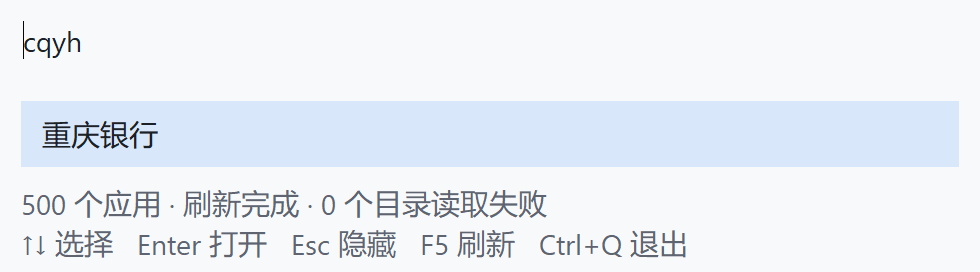
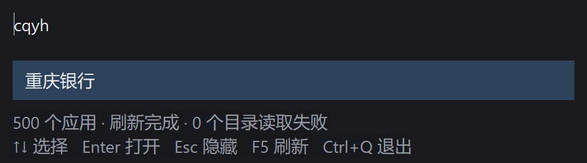
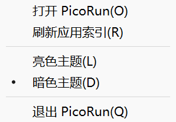

# 托盘、亮暗主题与优化验证

2026-10-03，Windows 原生托盘和亮/暗两套主题已完成。修掉几处重复分配和索引副本，搜索排名与拼音规则保持原样。本次真实目录复测显示，新增功能后的完整进程占用仍高于旧版，不能宣称产品整体内存下降；Shell 启动峰值仍待优化。

## 运行与实现

产物 `target/release/picorun.exe`，631,296 字节，SHA256 `0C46FC303D2EDBA38EDD5FA0EDE6D5FA6B95AC688492E37AF79962570AE652A6`。默认暗色，沿用 Alt+Space、Enter、Esc、F5、Ctrl+Q。没有新增第三方 Rust crate、后台轮询或网络功能。

- 单击托盘图标呼出窗口；右键菜单提供打开、刷新、亮色、暗色、退出。菜单有 O/R/L/D/Q 助记键，当前主题显示单选标记。
- 托盘采用 NOTIFYICON_VERSION_4，接收鼠标/键盘选择与上下文菜单事件；TaskbarCreated 时重新注册。只保留一个内置 32×32 图标，菜单关闭即释放。退出删除图标，释放热键、字体、画刷和句柄。
- 主题控制输入框、结果、选中背景和提示文字；切换保留查询与选中项。原生托盘菜单遵循 Windows 菜单外观。
- 主题选择保存到 LocalAppData 已知目录的 `PicoRun/theme.txt`，或 `--data-dir` 指定的数据目录；只有 `light` / `dark` 两个值。读取上限 64 字节，缺失或非法内容退回暗色，临时文件替换保存。
- `--theme light` / `--theme dark` 只覆盖本次启动；从托盘选择后保存。保存失败保留本次配色并显示状态错误。
- 应用结果图标、Store/UWP 枚举仍未实现。

版本 4 的事件编码和菜单前台/关闭处理依据微软接口文档。[NOTIFYICONDATAW](https://learn.microsoft.com/en-us/windows/win32/api/shellapi/ns-shellapi-notifyicondataw)、[通知区域](https://learn.microsoft.com/en-us/windows/win32/shell/notification-area)、[TrackPopupMenu](https://learn.microsoft.com/en-us/windows/win32/api/winuser/nf-winuser-trackpopupmenu)

## 已处理的优化

1. 成功发现应用后立即释放启动缓存快照，避免它与当前索引一直共存。
2. F5 不再先复制整份旧 Catalog。扫描在没有 Runtime 借用的情况下进行；返回后仅复制读取失败目录内需要保留的入口，全目录失败仍保留原索引。
3. 结果名称的 UTF-16 快照仅在结果变化时生成，重绘和选择变化共享不可变 Rc 快照；空结果和快捷键提示预先准备，减少绘制中的分配。
4. 查询后只有窗口尺寸变化才调用 SetWindowPos，减少无效布局调用。

这些改动消除确定的冗余成本，没有改变排名或在搜索时扫描磁盘。仍需要给 Shell 打开路径和 Win32/IME 加载成本做进一步分析，不能用清空工作集掩盖峰值。

## 验证

`cargo test --offline`：11 项通过；`cargo fmt --check`、`cargo clippy --offline --all-targets -- -D warnings`、`cargo build --release --offline` 和 `git diff --check` 均通过。GUI 测量对应相同产品源码；随后仅给探针加入旧版对照模式并重构建。最终产物已使用默认数据目录启动，确认窗口可见且 Shell 能查询到托盘图标；交付时以 `--theme light` 展示亮色，不覆盖保存的选择。

500 个合成应用快捷方式只打开受控测试程序；394 项真实索引仅查询，没有打开用户应用。原生探针通过：

- Shell_NotifyIconGetRect 确认系统已注册图标；版本 4 选择消息呼出窗口。
- 打开实际原生弹出菜单，向菜单投递助记字符执行亮色命令并检查保存；非单纯直接调用配色函数。
- 两套配色及保存亮色后重启的截图检查；切换保留查询，切换后的 Enter 仍启动原选中受控入口。
- 100 次主题切换、20 次原生菜单开关、20 次模拟 TaskbarCreated 恢复：GDI **19→19**，USER **14→14**，私有提交 **2.41→2.41 MiB**，工作集 **17.61→17.62 MiB**。
- 退出后图标消失、热键可重新注册；热键冲突、单实例、Delete、Copy/Paste、立即 Enter、原始快捷方式的参数/工作目录、失效入口与 F5、缓存损坏恢复、1000 次查询等回归通过。
- 1000 次查询前后 GDI **22→22**，USER **26→25**；私有提交 **10.22→10.31 MiB**。这是一次压力观察，不能证明无限期运行无泄漏。

模拟 TaskbarCreated 不等于杀掉/重启真实 Explorer；没有重启用户 Explorer。菜单通过真实弹出窗口和程序化字符消息验证；实际托盘鼠标点击、真实 IME 候选窗口、多显示器跨 DPI、Windows 10、x86 和低内存换页仍需人工/实机验收。

## 测量口径

i7-11700K，8 核/16 线程，32 GiB；Windows 11 Enterprise 25H2 build 26200，x64；Rust 1.95.0，MSVC，opt-level=3、fat LTO、codegen-units=1、panic=abort、strip、静态 CRT，离线 release。GUI 在当前交互桌面测量。MiB = 1,048,576 字节。

每个 GUI 套件 5 个独立进程；首次应用缓存缺失，第二次人为损坏，另外三次有效。启动仍完整扫描；没有清空系统文件缓存，不能称为磁盘冷启动。每进程 20 次输入预热，再记录 120 次六种查询；启动观察轮询约 5 ms。内存为 PrivateUsage / WorkingSetSize，峰值为进程创建以来的 PeakPagefileUsage / PeakWorkingSetSize。测量器、受控子程序、Explorer 的内存不计入 PicoRun，非全系统增量占用。没有调用清空工作集 API。

GUI 表中是五进程中位数，括号为最小–最大。查询时间是各进程 P50/P95 的中位数，未合并样本；首次启动/显示各 n=5，P95 取最近秩最大值。实际 Edit 文字更新、同步查询、布局与 GDI 绘制计入时间，跨进程消息成本计入；物理按键、真实 IME 候选和桌面合成不计入。

## 完整进程内存

| 来源与阶段 | 私有提交 MiB | 工作集 MiB |
| --- | ---: | ---: |
| 500 可控 · hidden | 2.07（2.02–2.10） | 14.34（14.27–14.36） |
| 500 可控 · shown | 3.10（2.33–3.12） | 20.77（16.92–20.77） |
| 500 可控 · input | 3.11（2.35–3.12） | 21.12（16.97–21.14） |
| 500 可控 · refreshed | 3.17（2.35–3.23） | 21.26（17.11–21.30） |
| 500 可控 · idle_end | 3.14（2.35–3.16） | 21.69（17.11–21.70） |
| 394 真实 · hidden | 3.68（3.52–3.80） | 20.95（20.91–21.05） |
| 394 真实 · shown | 4.44（3.73–4.61） | 26.53（23.02–26.67） |
| 394 真实 · input | 4.48（3.75–4.66） | 26.92（23.07–27.06） |
| 394 真实 · refreshed | 4.64（3.81–4.71） | 27.15（23.24–27.16） |
| 394 真实 · idle_end | 4.54（3.71–4.61） | 27.16（23.24–27.17） |

500 可控全场景含 Shell 启动、注入 IME、恢复、主题与查询压力，最大峰值私有提交 **45.43 MiB**，工作集 **81.19 MiB**。首次 Shell 后峰值提交 44.26 MiB；普通主题压力没有制造同等级峰值。394 真实查询场景峰值提交 **4.96 MiB**、工作集 **27.38 MiB**。两种场景不能混用。

隐藏后每进程稳定 1 秒再测 5 秒 CPU 增量：真实目录五次均 0 ms；可控五次为 0、0、46.875、46.875、31.250 ms。主消息循环使用阻塞 GetMessage，无自建定时轮询；不将本机观测解释为所有环境零 CPU。

## 原生窗口响应

| 来源 | 启动 P50/P95 ms | 首次显示 P50/P95 ms | 输入 P50/P95 中位数 ms | 输入 P95 范围 ms |
| --- | ---: | ---: | ---: | ---: |
| 500 可控 | 266.48 / 328.92 | 51.42 / 56.36 | 3.83 / 6.70 | 4.12–7.95 |
| 394 真实 | 447.43 / 538.74 | 43.29 / 47.65 | 5.24 / 7.72 | 7.02–9.02 |

## 同机旧版复测

保留旧 exe（SHA256 1091F2D534BA04C693550B66FD06E3A847C710FE6F5AB22053848AB9ADD9F22A），用同一真实目录、同一路径、同样五进程流程复测，探针 `--real --baseline` 仅跳过旧版没有的托盘验收；正常旧版退出用 WM_CLOSE。两套顺序执行，非交错随机配对，因此时间差和系统加载差不能完全归因代码。

| 394 真实 · 中位数 | 旧版 | 本次 |
| --- | ---: | ---: |
| 隐藏私有提交 MiB | 3.40 | 3.68 |
| 显示私有提交 MiB | 3.73 | 4.44 |
| 显示工作集 MiB | 23.06 | 26.53 |
| 首次显示 ms | 22.94 | 43.29 |
| 输入 P95 ms | 8.05 | 7.72 |

增加托盘和主题后，隐藏私有提交净增约 0.29 MiB，显示占用和首次显示时间也上升。代码消冗未抵消本次完整功能与系统加载成本，不能宣称整体更小或全面更快。后续应优先剖析 Shell 启动峰值、首次显示加载与完整进程开销。

## 纯搜索：500 / 2000 / 10000

固定第一个可用 CPU，5 个独立基准进程，每规模预热 20×12 查询，正式每进程 100×12 = 1200 样本，采用最近秩 P95。只计 search 调用，排除发现、拼音索引、GUI 和应用启动。表取各进程分位数中位数，不是合并后的 P95。

| 项数 | P50 ms | P95 ms | P95 范围 ms | 索引构建中位数 ms | 索引拥有容量 bytes |
| --- | ---: | ---: | ---: | ---: | ---: |
| 500 | 0.0278 | 0.0533 | 0.0520–0.1040 | 0.9795 | 121074 |
| 2000 | 0.1147 | 0.2561 | 0.2219–0.5858 | 2.7361 | 488874 |
| 10000 | 0.8899 | 1.8793 | 1.5303–2.4368 | 15.1702 | 2461674 |

预热前首次搜索的五次中位数为 35.3 / 228.8 / 1000.1 µs，每进程每规模只有一个首次样本，不能据此声称冷启动 P95。搜索算法没有在本次修改，时序会随桌面负载波动；500 项单轮 P95 最大 0.1040 ms，也不宣称所有测量都低于 0.1 ms。核心数字不能替代上面的完整进程或窗口响应。

原始记录均在忽略的 `runtime/`：`probe-controlled/{memory.csv,timings.txt,checks.txt}`、`probe-real/{memory.csv,timings.txt,checks.txt,baseline-memory.csv,baseline-timings.txt,baseline-checks.txt}`、`search-bench-tray-theme-1..5.txt`；个人入口及缓存不提交。旧版文件和前次可控结果保留在 `runtime/tray-theme-baseline/`，历史报告见 [NATIVE_RESULTS.md](NATIVE_RESULTS.md)。
